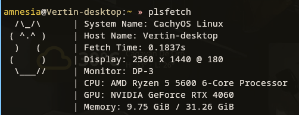
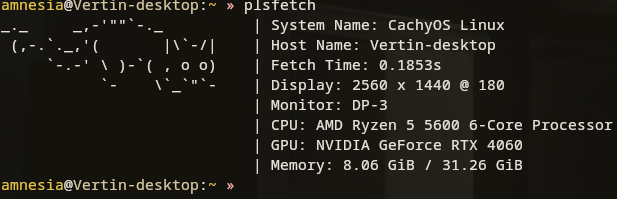
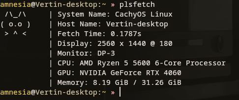

# plsfetch

A fast and customizable system fetching tool written in Rust. Similar to neofetch and fastfetch.
<br>

## Prerequisites

- **Rust** 
  - Install via [rustup](https://rustup.rs/):
    ```bash
    curl --proto '=https' --tlsv1.2 -sSf https://sh.rustup.rs | sh
    ```
- Ensure `cargo` is in your PATH:
    ```bash
    rustc --version
    cargo --version
    ```

## Installation

Install plsfetch with cargo

- Clone this repository
```bash
  git clone https://github.com/svl10/plsfetch.git
  cd plsfetch
```
- Install using cargo
```bash
  cargo install --path .
  ```

- Run plsfetch
```bash
  plsfetch
```
<br>

## Sample Screenshots
### Cat Sit



### Cat Stretch



### Cat Curious

